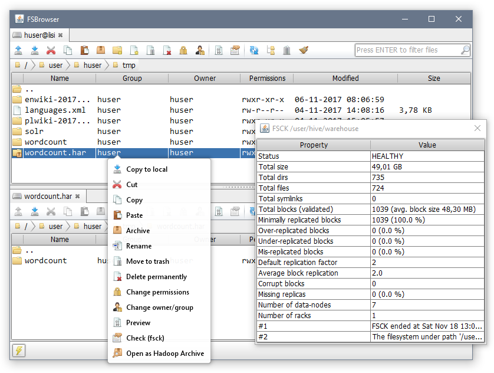

# FSBrowser

FSBrowser is a desktop GUI client for Hadoop Distributed File System. 
The application can be used as a more efficient alternative to Hue's file browser, especially on IO heavy operations,  since it 
is based on native hadoop libraries instead of HttpFS.

### Features
* Sending files and directories:
  * Between local file system and HDFS
  * Between different HDFS clusters (DistCp)
* Browsing, searching, sorting directories with milions of files
* Support for creating and browsing Hadoop Archives (HARs)
* GUI interface for hadoop tools:
  * Distributed copy (DistCp)
  * File System Check (fsck)
* Utils for cleaning temporary and staging directories
* Multiple active connections (tabs)

### Installation

1. Maven and JDK8 are the only compile-time prerequisites. Build application with `mvn package`. 
2. Run `java -jar target/fsbrowser.jar`.

Note that some actions require additional native hadoop libraries (for example DistCp or Hadoop Archive tools).
While FSBrowser will run without them, it's recommended to have them installed.
For Windows, you can download precompiled binary package [here](https://github.com/sardetushar/hadooponwindows/archive/master.zip).
After extracting, set `HADOOP_HOME` environment variable to the extracted directory and add `bin` subdirectory to your `PATH` variable.

### Acknowledgments
- This project uses [Fugue Icons](http://p.yusukekamiyamane.com/) by [Yusuke Kamiyamane](http://p.yusukekamiyamane.com/about/)
